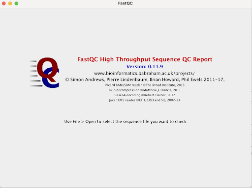
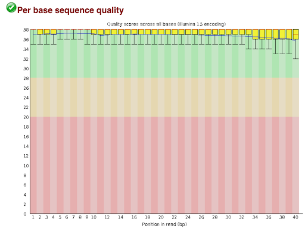
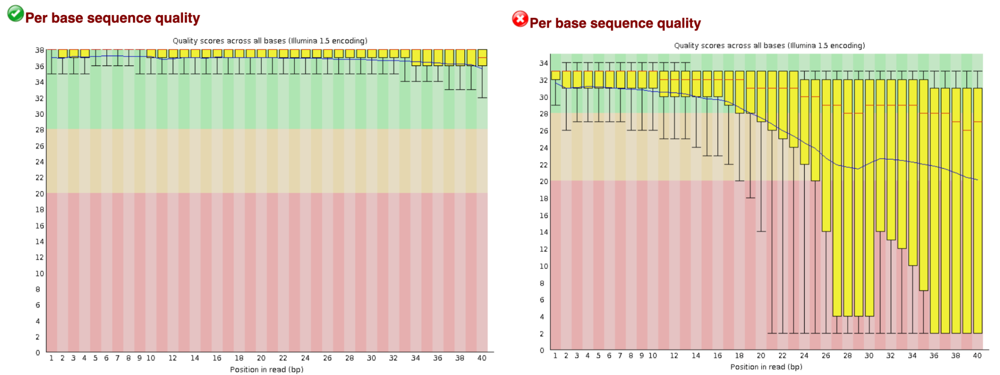
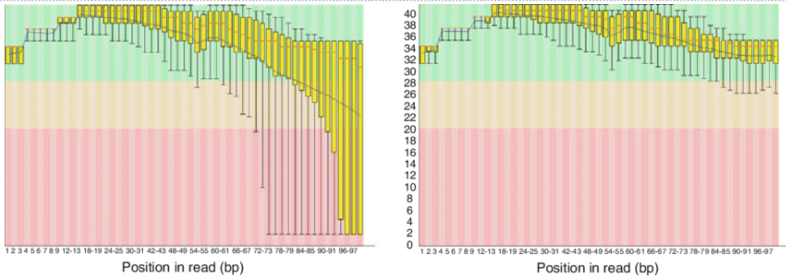

# FastQC Analysis
---
FastQC is an important and easy to use tool for quality control on raw input data. It can import data from SAM, BAM, and FastQ files and create an HTML file presenting information about your read quality and sequence. The FastQC report features many important graphs and diagrams that we will cover in detail.

## How to use FastQC
---
FastQC can be used in two different ways depending on your operating system or general preference. Either can be downloaded as an application (Fig 1.) or as a java application that can be used in multiple coding environments.

If you choose to opt for the java application, you would use the following command to produce a FastQC html file for your FastQ, SAM or BAM files. 

`fastqc file.fastq|bam|sam`  
- command to produce fastqc files from reads

You can also use the following command to access the help page with detailed descriptions of fastqc commands: `fastqc -h`   

## Analyzing FastQC Output: Per Base Sequence Quality
---
A key FastQC metric that should be accounted for is **per base sequence quality**. Per base sequence quality refers to the Phred quality score at each position in a read. FastQC summarizes this information in graph form, with the X axis corresponding to what position the base is in the read, and the Y axis corresponding to the quality score. So, the values at position “1” on the X axis would represent the distribution of Phred quality scores for the first base of a read, across every read.

Other notable features of this graph are listed below:
1. **Yellow Boxes**: The yellow boxes at each position encompass the middle 25th to 75th percentile of the quality score distribution at that position.
2. **Whiskers**: The whiskers on each side of a yellow box represent the data outside the middle 25th to 75th percentile. Both the size of the yellow boxes, and the size of the whiskers indicate how spread out the quality scores are from each other
3. **Red line**: The red line in each yellow box corresponds to the median quality score for that base position

### Per Base Sequence Quality: Good vs Bad Report

Below is an image depicting two FastQC Per Base Sequence Quality outputs: a "good" one (left), and a "bad" one (right).

When put side-by-side, it is clear why the left graph is better. All of the quality scores, even the biggest outliers, are above 30. On the right graph, we can see that even the middle 50% for the distribution of many positions is below 20 (the red zone). 

So, if our output looks like the graph on the right, do we have to throw out our data and generate new reads? No, of course not: we can utilize **read trimming**!

### Trimming Poor Reads

Looking again at the "good" vs "bad" graph outputs, we can see that there is a trend reflected in both of these graphs (although much more clearly in the right one). **The read quality scores tend to become poorer near the end of reads**. This is a common artifact of read collection, and can result in seemingly awful quality distributions. So, to remove this experimental noise, we can remove these poor quality end positions from our reads.

**Read Trimming**: To remove these poor quality bases, various existing bioinformatics packages can be utilized. One such package is *Scythe*, which uses a machine-learning based algorithm to classify regions that drop off significantly in quality and are likely experimental artifacts. After applying one of these tools to our fastq file and then generating a new FastQC report, we should see a significant reduction in steep drop-offs near the end of these graphs. A sample before and after graph can be seen below.

