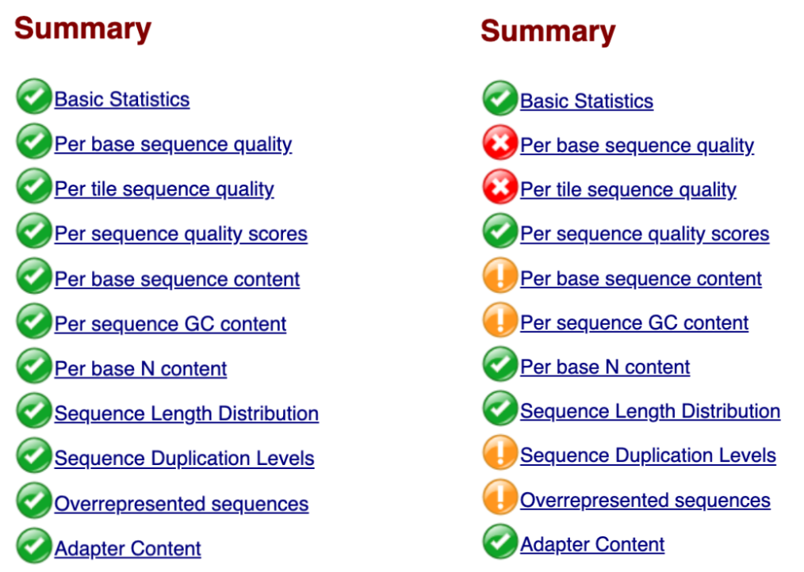
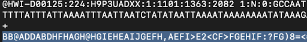
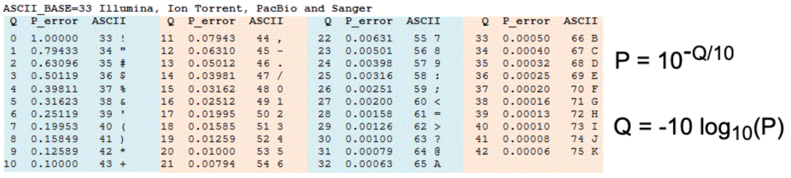
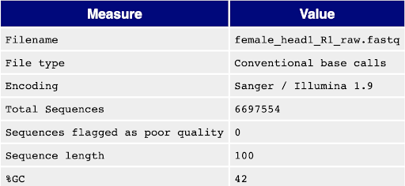
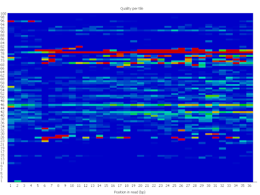
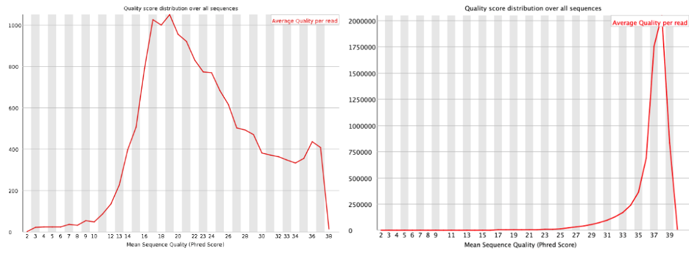
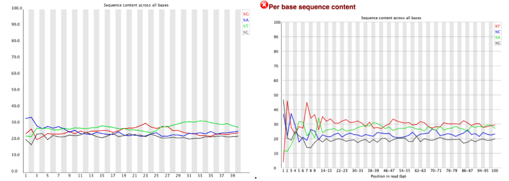

# FastQC Analysis

FastQC is an important and easy to use tool for quality control on raw input data. It can import data from SAM, BAM, and FastQ files and create an HTML file presenting information about the read quality and sequences of the input file. The FastQC report features several diagrams that represent different metrics of read quality specific to the input file. In this section, each of these metrics will be discussed in detail, including how to interpret their associated diagrams.

## How to use FastQC

FastQC can be used in two different ways depending on your operating system or general preference. Either can be downloaded as an application (Fig 1.) or as a java application that can be used in multiple coding environments.

- ###### **Figure 1**: FastQC desktop application start screen (1)

When using the java application, the following command produces a FastQC HTML file when given a FastQ, SAM or BAM file as input:

`fastqc file.fastq|bam|sam`  
- Command to produce fastqc files from reads

For example, if the input file were named "my_bam_file.bam", the proper command would be:
`fastqc my_bam_file.bam`
If there are multiple files that need to be independently analyzed by FastQC, the filenames can simply be listed one after the other, with spaces to separate them:

`fastqc my_fastq_file1.fastq my_fastq_file2.fastq my_fastq_file3.fastq`

Running the above command would result in a set of FastQC quality control reports, one for each input file (1).

If something other than the standard FastQC report is needed or if different options need to be specified for a run, the following command opens the FastQC help file which contains detailed descriptions of all FastQC program options (1):`fastqc -h`   

# FastQC results: what makes a good vs. bad report?

- ###### **Figure 2**: Two FastQC summaries side by side. The first summary has all green checks (2). The second summary includes green checks, yellow exclamations, and red crosses (3).

## Phred Quality Score

Before we dive into each figure produced by FastQC,we must first talk about an important score used to grade each read's quality. When illumina sequencing produces a FastQ file, each base 
pair includes a character score (Fig 3.). 

- ###### **Figure 3**: An example of a cluster in a FastQ file. The first line designates the sequence id, the second line is the sequence, the third line is a plus sign and the final sequence is the corresponding score for each base pair.

This score is called the Phred Quality Score and is designated by ASCII+33 characters. This means that the score starts at the thirty third character in an ASCII table, the exclamation point (Fig 4.). 

- ###### **Figure 4**: Phred Score Table for new Illumina(4). Q is the score value, P_error is the chance of error, and ASCII is the number in ASCII and the character corresponding with it.

These scores are associated with equations and the idea is the higher the Q score, the less likely the base pair is wrong. For example, if your base pair has a score of 30, then there is a 99.9% chance that it is the correct base pair. This score is used throughout FastQC, most importantly in Per Base Sequence Quality graphs.

## Basic Statistics

- ###### **Figure 5**: An example of Basic Statistics

Basic Statistics is the first figure in the FastQC file (Fig. 5). It is self explanatory, with a table featuring two columns, Measure and Value and the subsequent title for each measure and the value associated with that measure. It includes the filename, the file type, the type of encoding, the total number of sequences, the number of sequences flagged for poor quality, sequence length and percent of GC content.
## Analyzing FastQC Output: Per Base Sequence Quality

A key FastQC metric that should be accounted for is **per base sequence quality**. Per base sequence quality refers to the Phred quality score at each position in a read (see Fig. 6 for graphs). FastQC summarizes this information in graph form, with the X axis corresponding to what position the base is in the read, and the Y axis corresponding to the quality score. So, the values at position “1” on the X axis would represent the distribution of Phred quality scores for the first base of a read, across every read.

Other notable features of this graph are listed below (see Fig. 6):
1. **Yellow Boxes**: The yellow boxes at each position encompass the middle 25th to 75th percentile of the quality score distribution at that position.
2. **Whiskers**: The whiskers on each side of a yellow box represent the data outside the middle 25th to 75th percentile. Both the size of the yellow boxes, and the size of the whiskers indicate how spread out the quality scores are from each other
3. **Red line**: The red line in each yellow box corresponds to the median quality score for that base position

### Per Base Sequence Quality: Good vs Bad Report

Below is an image depicting two FastQC Per Base Sequence Quality outputs: a "good" one (left), and a "bad" one (right).

- ###### **Figure 6**: 

When put side-by-side, it is clear why the left graph is better. All of the quality scores, even the biggest outliers, are above 30. On the right graph, we can see that even the middle 50% for the distribution of many positions is below 20 (the red zone). 

So, if our output looks like the graph on the right, do we have to throw out our data and generate new reads? No, of course not: we can utilize **read trimming**!

### Trimming Poor Reads

Looking again at the "good" vs "bad" graph outputs, we can see that there is a trend reflected in both of these graphs (although much more clearly in the right one). **The read quality scores tend to become poorer near the end of reads**. This is a common artifact of read collection, and can result in seemingly awful quality distributions. So, to remove this experimental noise, we can remove these poor quality end positions from our reads.

**Read Trimming**: To remove these poor quality bases, various existing bioinformatics packages can be utilized. One such package is *Scythe*, which uses a machine-learning based algorithm to classify regions that drop off significantly in quality and are likely experimental artifacts. After applying one of these tools to our fastq file and then generating a new FastQC report, we should see a significant reduction in steep drop-offs near the end of these graphs. A sample before and after graph can be seen below.

- ###### **Figure 7**: 

## Per Tile Sequence Quality

This figure will only be available if the file has the Illumina sequence identifiers, however, it is a helpful image in figuring out possible areas of issue in the flow cell. This figure is better known as a heatmap, with the cooler colors (shades of blue) representing bases with a quality higher than the average and the warmer colors (red, yellow, orange) representing reads with quality worse than the average read of the sequence (5).
An ideal Per Tile Sequence Quality heatmap would be entirely dark blue, unlike Figure 8 which includes both good and bad reads and where they are located (Fig. 8).

- ###### **Figure 8**: Quality per tile heatmap example (5). There is an area of the flow cell that is producing lower quality reads.

## Per Sequence Quality Scores

Per Sequence Quality Score graphs represent quality scores over all the sequences with the red lining representing the average quality per read. The Y axis is the number of reads and the X axis is the quality score. 

A good library has an exponential graph, ideally with a peak at a quality score greater than 35 (Fig. 9). This would mean the majority of base pairs are statistically likely to be correct. A bad library peaks early or has many peaks, at lower quality score values. 

- ###### **Figure 9**: The first graph shows a worse average quality with more than 1000 reads having a score of around 16 to 20 with the read quality falling off afterwards (6). The second graph shows high quality reads with nearly all reads with a quality score of 38.

## Per Base Sequence Content

Per base sequence content demonstrates the percent of each base is featured in the library. A correct library would have the percent for each being around the same value and the lines staying parallel over all base pairs (Fig. 10). A graph that has bias in the library has spikes and dips which can result in the system giving a warning or error. If there are peaks, it means there can be overrepresented sequences (7).

- ###### **Figure 10**: The first graph features parallel lines and similar percentages (7). The second graph has great peaks at the beginning which shows bias, but evens out later in the graph.

## Per Sequence GC Content

Overall GC content distribution is another important metric to take into account. When the GC distribution over all sequences is plotted, it should look roughly normally distributed. In the graphs below, the blue line represents the known distribution of GC content for an organism, and the red line shows how the experimental reads fit to this distribution.